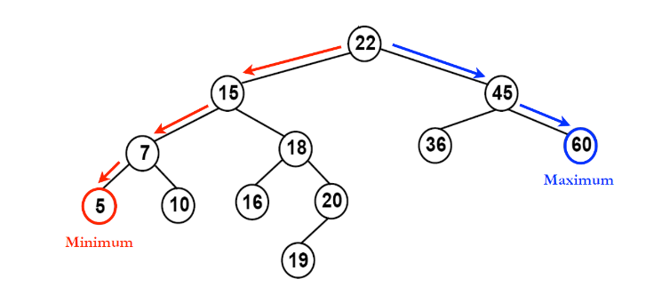

# 이진 탐색 트리 (Binary Search Tree)

    - 이진 탐색 트리는 이진 트리 기반의 탐색을 위한 자료 구조이다.



## 이진 탐색 트리 정의

    - 모든 원소의 키는 유일한 키를 가진다.
    - 왼쪽 서브 트리 키들은 루트 키보다 작다.
    - 오른쪽 서브 트리의 키들은 루트의 키보다 크다.
    - 왼쪽과 오른쪽 서브 트리도 이진 탐색 트리이다.

- 이러한 성질을 이용하여 탐색을 쉽게 할 수 있다. 

## 이진 탐색 트리 탐색연산

이진 탐생 트리에서 특정한 키값을 가진 노드를 찾기 위해서는 먼저 주어진 탐색키 값과 루트노드의 키값을 비교한다. 비교한 결과에 따라 다음의 3가지로 나누어진다.

    - 비교한 결과가 같으면 탐색이 성공적으로 끝난다.
    - 비교한 결과가, 주어진 키 값이 루트 노드의 키값보다 작으면 탐색은 이 루트 노드의 왼쪽 자식을 기준으로 다시 시작한다.
    - 비교한 결과가, 주어진 키 값이 루트 노드의 키값보다 크면 탐색은 이 루트노드의 오른쪽 자식을 기준으로 다시 시작한다.

```c
//순환적인 탐색 함수
TreeNode* search(TreeNode* node, int key){
    if (node==NULL) return NULL;
    if (key == node->key) return node;
    else if (key < node -> key) 
        return search(node -> left, key);
    else //(key > node -> key)
        return search(node -> right, key);
}
```

```c
// 반복적인 탐색 함수
TreeNode* search(TreeNode* node, int key){
    while(node!=NULL){
        if(key == node- > key) return node;
        else if (key < node -> key)
            node = node -> left;
        else
            node = node -> right;
    }
    return NULL //탐색에 실패했을 경우 NULL 반환
}
```

## 이진 탐색 트리 삽입연산

    - 이진 탐색 트리에 원소를 삽입하기 위해서는 먼저 탐색을 수행하는 것이 필요하다. 
    - 그 이유는 이진 탐색 트리에서는 같은 키 값을 갖는 노드가 없어야 하고 탐색에 실패한 위치가 바로 새로운 노드를 삽입하는 위치가 되기 때문이다.
    - 새로운 노드는 항상 단말노드에 추가된다.

```c
TreeNode* insert_node(TreeNode* node, int key){
    //트리가 공백이면 새로운 노드를 반환한다.
    if(node==NULL) return new_node(key);

    if(key< node->key)
        node->left = insert_node(node->left, key);
    else if (key > node->key)
        node->right = insert_node(node->right, key);

    return node;
    // 변경된 루트 포인터를 반환한다.
}

TreeNode* new_node(int item){
    TreeNode* tmp = (TreeNode*)malloc(sizeof(TreeNode));
    tmp->key = item;
    tmp->left = tmp->right = NULL;
    return tmp;
}
```

## 이진 탐색 트리 삭제 연산

- 노드를 삭제하기 위해서 먼저 노드를 탐색하여야 한다는 것은 삽입과 마찬가지이다.
- 노드를 탐색하였으면 다음의 3가지 경우를 고려해야 한다.
    - 삭제하려는 노드가 단말 노드일 경우
    - 삭제하려는 노드가 하나의 왼쪽이나 오른쪽 서브 트리중 하나만 가지고 있는 경우
    - 삭제하려는 노드가 두개의 서브 트리 모드 가지고 있는 경우 

1. 삭제하려는 노드가 단말 노드일 경우
    - 단말 노드의 부모 노드를 찾아서 부모노드의 링크를 NULL로 만들어서 연결을 끊으면 된다.

2. 삭제하려는 노드가 하나의 서브트리만 가지고 있는 경우
    - 삭제되는 노드가 왼쪽이나 오른쪽 서브 트리중 하나만 가지고 있는 경우에는 자기 노드는 삭제하고 서브 트리는 부모 노드에 붙여주면 된다.

3. 삭제하려는 노드가 두개의 서브트리를 가지고 있는 경우
    - 삭제한 노드를 가리키던 부모의 포인터에 다음 값을 할당한다.
        - 왼쪽 서브트리의 가장 큰 값 또는 서브 트리의 가장 작은 값을 지닌 노드 포인터
    -새로 할당한 값에 삭제한 노드의 left, right 포인터를 할당한다.

```c
TreeNode* delete_node(TreeNode* root, int key){
    if(root==NULL) return root; //삭제할 데이터가 없는 경우
    if(key< root->key)
        root->left = delete(root -> left,key);
    else if(key > root->key)
        root->right = delete(root -> right,key);
    else{ //key == root->key
        //1번의 경우
        if(root->left ==NULL && root->right == NULL)
            root = NULL;
        //2번의 경우
        if(root->left == NULL){
            root = root->right;
        }
        if(root->right ==NULL){
            root = root->left;
        }
        //3번의 경우
        else{ 
            TreeNode* tmp = Minimum(root->right);
            root->key = tmp->key;
            root->right = delete_node(root->right,tmp->key);
        }
    }
    return root;
}

TreeNode* Minimum(TreeNode* node){
    TreeNode* current = node;
    while(current->left!=NULL){
        current = current->left;
    }
    return current;
}
```
## 이진 탐색 트리 분석

- 이진 탐색 트리에서의 탐색, 삽입, 삭제 연산의 시간 복잡도는 트리의 높이를 h라고 했을 때 O(h)가 된다.
- 일반적인 이진 탐색 트리의 높이는 (log_2 n)이므로 시간복잡도는 O(log_2 n)이 된다.
- 최악의 경우네는 트리의 높이가 n이 되므로 시간복잡도는 O(n)이 된다.

| Algorithm | Average | Worst case |
| --- | --- | --- |
| Search | O(log_2 n) | O(n) |
| Insert | O(log_2 n) | O(n) |
| Delete | O(log_2 n) | O(n) |

## 이진 탐색 트리 구현
[BST(Binary Search Tree)](BST.c)