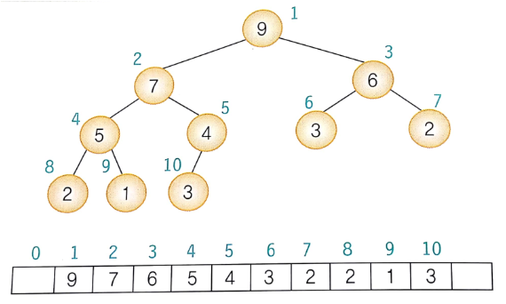

# 우선순위 큐

우선순위 큐는 우선 순위 개념을 큐에 도입한 자료구조이다. 데이터 들이 우선 순위를 가지고 있고 우선 순위가 높은 데이터가 먼저 나가게 된다.

## 우선순위 큐 구현

1. 배열을 사용하는 방법
    - 정렬이 돼있지 않은 배열 
        - 삽입 시 배열의 맨 끝에 새로운 요소를 추가하면 되므로 시간 복잡도는 O(1)이다.
        - 하지만 삭제 시 가장 우선 순위가 높은 요소를 찾아야 하므로 모든 요소를 스캔해야 되기 때문에 시간 복잡도는 O(n)이 된다.
    - 정렬이 돼있는 배열
        - 삽입 시 다른 요소와 값을 비교하여 삽입 위치를 결정해야하므로 탐색을 하고 다른 요소들을 이동시켜야 하므로 시가복잡도는 일반적으로 O(n)이 된다.
        - 대신 삭제 시에는 시간복잡도가 O(1)이 된다.

2. 연결리스트를 사용하는 방법
    - 정렬이 돼있지 않은 연결리스트
        - 정렬이 돼있지 않은 연결리스트는 맨 앞에 삽입하면 되므로 포인터만 변경하면 되므로 시간복잡도는 O(1)이 된다.
        - 삭제 시에는 모든 노드를 뒤져봐야하므로 시간복잡도는 O(n)이 된다.
    - 정렬이 돼있는 연결리스트
        - 삽입 시 삽입 위치를 찾아야 하므로 시간복잡도는 O(n)이 된다.
        - 삭제 시에는 첫 번째 노드를 삭제하면 되므로 시간복잡도는 O(n)이 된다.

3. 히프
    - 히프는 완전 이진 트리의 일종으로 우선순위 큐를 위하여 특별히 만들어진 자료 구조이다.
    - 히프의 효율은 삽입과 삭제 모두 시간복잡도가 O(log_2 n)이 된다.

| 표현 방법 | 삽입 | 삭제 |
| --- | --- | --- |
| 순서 없는 배열 | O(1) | O(n) |
| 순서 없는 연결리스트 | O(1) | O(n) |
| 정렬된 배열 | O(n) | O(1) |
| 정렬된 연결리스트 | O(n) | O(1) |
| 히프 | O(log_2 n) | O(log_2 n) |

# 히프

히프는 완전이진트리 기반의 자료 구조를 의미한다. 히프는 여러 개의 값들 중에서 가장 큰 값이나 가장 작은 값을 빠르게 찾아내도록 만들어진 자료 구조이다.

히프는 중복된 값을 허용하며 다음과 같은 조건이 항상 성립하는 트리이다.
```
최대 히프
key(부모노드) >= key(자식노드)
최소 히프
key(부모노드) <= 
```

## 히프의 구현

- 히프는 배열을 이용하여 구현을 하며 배열의 첫 번째 인덱스 0은 사용하지 않는다.
    - 왼쪽 자식의 인덱스 = (부모의 인덱스) * 2
    - 오른쪽 자식의 인덱스 = (부모의 인덱스) * 2 + 1
    - 부모의 인덱스 = (자식의 인덱스) / 2

- 삽입 연산
    - 히프에 새로운 요소가 들어오면, 일단 새로운 노드를 일단 히프의 마지막 노드로 삽입한다. 그 후에 새로운 노드를 부모 노드들과 교환해서 히프의 성질을 만족할 때 까지 반복한다.

```c
//삽입 함수
void insert_max_head(HeapType* h, element item) {
    int i;
    i = ++(h->heap_size);

    //부모노드와의 비교 후 스왑
    while ((i != 1) && (item.key > h->heap[i / 2].key)) {
        h->heap[i] = h->heap[i / 2];
        i = i / 2;
    }
    h->heap[i] = item; //모든 연산이 끝난 후 item 삽입
}
```

- 삭제연산
    - 최대 히프에서 삭제 연산은 최대값을 가진 요소를 삭제하는 것이다. 그 말은 루드 노드가 삭제되는 것이다. 그 후 빈 루트 노드 자리에는 마지막 노드를 가져와서 히프를 재구성한다.

```c
//삭제 함수
element delete_max_heap(HeapType* h){
    int parent, child;
    element item, temp;

    item = h->heap[1];
    temp = h->heap[(h->heap_size)--]; //마지막 배열에 있는 값
    parent = 1;
    child = 2;
    while(child <= heap_size){ 
        //더 큰 자식의 노드를 찾는다.
        if((child < h->heap_size)&&(h->heap[child].key < h->heap(child+1).key))
        child++;
        if(temp.key>=h->heap[child].key) break; //부모가 더 크다면 스탑
        //자식이 더 크다면 스왑
        else if(h->heap[child].key > h->heap[parent].key){  
            h->heap[parent].key = h->heap[child].key;
            parent = child;
            child = child*2;
        }
    }
    h->heap[parent] = temp; //맨처음 복사했던 마지막 노드 삽입
    return item;
}
```

## 히프 코드 구현
[Heap.c](Heap.c)

## 히프 정렬
- 최대 히프를 이용하면 정렬을 할 수 있는데 한 번에 하나씩 요소를 히프에서 꺼내서 배열의 뒤쪽부터 저장하면 된다.
- n개의 요소는 O(nlog_2 n) 시간 안에 정렬된다.
- 간단한 정렬알고리즘이 O(n^2) 걸리는 것에 비해면 매우 좋은편이다.
