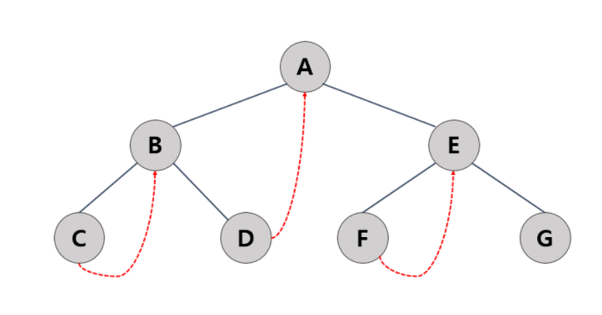

# 스레드 이진 트리 (Thread Binary Tree)

    - 스레드 이진 트리는 중위 순회를 기본으로 한다.
    - 이진 트리는 많은 NULL 링크를 가지고 있다. 트리의 노드의 개수를 n개라고 하면 각 노드당 2개의 링크가 있으므로 링크의 개수는 2n이 되고 이 중 n+1개의 링크가 NULL 포인터 값을 갖는다.
    - 이 NULL 포인터 값 대신 중위 후속자(inorder successor : 중위 순회 시에 후속 노드)를 저장시켜 놓은 트리가 스레드 이진 트리이다.

## 구조


- 위에서 중위 순회인 경우 처음 방문하는 노드가 C인데 다음으로 방문할 노드는 B노드 이므로, C의 링크를 B에 연결 시킨다.
 - 이런 식으로 NULL 링크에 스레드가 저장된다면, 링크에 자식을 가리키는 포인터가 저장되어 있는지 중위후속자를 가리키는 스레드가 저장되어 있는지 구분이 안된다. 따라서 이를 구별해주는 "태그"가 필요하다

```c
typedef struct TreeNode{
    int data;
    struct TreeNode* left,* right;
    int is_Thread;  //만약 오른쪽 링크가 스레드이면 TRUE
}
```
- 만약 is_Thread가 True이면 right는 중위 후속자이고 is_Thread가 False이면 오른쪽 자식을 가리키는 포인터가 된다.

- 만약 is_thread가 아닌 경우는 서브 트리의 가장 왼쪽 노드로 가야한다.
    - is_thread가 False인 경우는 내 자신이 루트노드 또는 중위후속자일 때 혹은 오른쪽 서브트리의 마지막 오른쪽 노드이다.

```c
// 트리에서 중위 후속자(노드)를 반환하는 알고리즘
TreeNode *find_successor(TreeNode* t){
    // pright t의 오른쪽 포인터
    TreeNode* pright = t->right;

    //만약 오른쪽 포인터가 NULL이거나 스레드이면 오른쪽 포인터를 반환
    // 오른쪽 포인터가 NULL이라는 뜻은, 더이상 후속자가 없다는 것이다. 즉 오른쪽 서브트리의 맨 밑단인 것이다.
    if (pright ==NULL || t->is_thread == TRUE)
        return pright;

    //만약 pright(t의 오른쪽 포인터)가 NULL이 아니면, 왼쪽 서브트리가 존재한다는 뜻이므로 왼쪽 서브트리로 이동한다.
    // pright가 새로운 V가 되므로 왼쪽 서브트리로 이동하는 것이다.
    while(pright->left != NULL )
        pright = pright->left;

    return pright;
} 
```

```c
// 스레드 중위 순회 알고리즘

void thread_inorder(TreeNode *t){
    TreeNode *q;
    q = t;
    while(q->left !=NULL) q = q->left // 가장 왼쪽 노드로 이동한다.
    do{
        printf("%c -> ", q->data);
        q = find_successor(q);
    }while(q != NULL);  //중위후속자가 존재하는 한 무한반복
}  
```

- 스레드 트리는 순회를 빠르게 하는 장점이 있지만 스레드를 설정하기 위하여 설정하기 위해 삽입 및 삭제등 함수가 좀 더 많은 일을 하게끔 설계해야하는 단점이 있다.