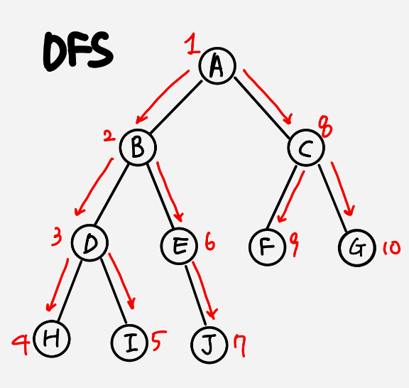
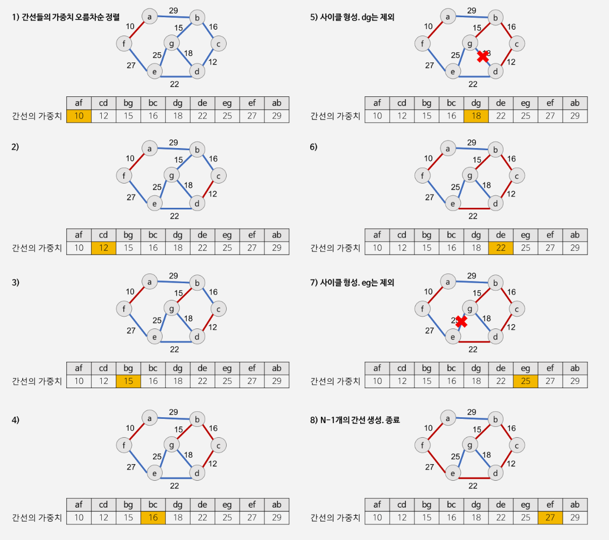

# 그래프 탐색 
그래프 탐색은 하나의 정점으로부터 시작하여 차례대로 모든 정점들을 한 번씩 방문하는 것이다.

특정한 정점에서 다른 정점으로 갈 수 있는지 없는지를 그래프 탐색을 통해서 알 수 있다.

그래프의 탐색 방법은 깊은 우선탐색(DFS)와 너비 우선 탐색(BFS)가 있다.

## 깊이 우선 탐색 (DFS: depth first search)


- 루트 정점에서 시작해서 다음 분기로 넘어가기 전에 해당 분기를 완벽하게 탐색하고 넘어가는 방법.
- 넒게 탐색하기 전에 깊게 탐색한다.

- DFS는 다음과 같은 방법으로 실행된다.
    1. 출발점 v를 방문한 것을 표시한다.
    2. v에 인접해있고 방문하지 않은 정점 w를 선택하여 w를 출발점으로 다시 깊이 우선 탐색을 진행한다.
    3. 어 이상 방문하지 않은 정점이 없으면 이전 정점으로 역추적(backtracking)을 한다.
    4. 모든 정점을 방문할 때 까지 프로세스를 반복한다.

```c
//인접 행렬을 이용한 DFS
int visited[MAX];   //방문한 정점 표시

void DFS(Graph* g,int v){
    int w;
    printf("visit : %d -> ",v); //방문
    visited[v] = TRUE;  //방문한 정점 표시
    
    for (w=0;w<g->n;w++){  //모든 정점 방문 (g->n은 최대 정점의 값)
        if(!visit[w])       //방문한 정점가 아니면
            DFS(g,w);       //정점 w에서 다시 시작
    }
} 
```

```c
//인접 리스트를 이용한 DFS
int visited[MAX];

void DFS(GraphType* g,int v){
    GraphNode* w;
    visited[v] = TRUE;
    printf("visit : %d ->",v);
    for(w = g->adj_list[v]; w ; w=w->link){ //모든 정점 방문
        if(!visit[w->vertex])
            DFS(g,w->vertex);   //정점 w에서 다시 시작
    }
}
```

- 인접 행렬의 시간복잡도 (N: 정점의 수 E: 간선의 수)
    - 한 정점당 N번의 loop를 돌고 N개의 정점을 모두 방문 해야하므로 O(N^2)의 시간복잡도를 가지게 된다.
- 인접 리스트의 시간복잡도
    - 각 정점에 연결되어있는 간선의 개수만큼만 N번 반복해서 방문하므로 O(N+E)의 시간복잡도를 가지게 된다.

## 너비 우선 탐색 (BFS: breath first search)
BFS는 시작 정점으로부터 가까운 정점을 먼저 방문하고 멀리 떨어져 있는 정점을 나중에 방문하는 순회 방법이다.


- BFS알고리즘은 큐 자료구조를 이용해서 방문을 기록한다. 탐색 진행 방식은 다음과 같다.
    1. 시작 정점을 큐에 넣는다.(여기서 큐는 '방문했다'라는 것을 의미한다.)
    2. 큐의 첫번째 정점을 꺼내서 방문하고 꺼낸 정점에 인접한 방문하지 않은 모든 정점들을 큐에 삽입한다.
    3. 큐가 비어있으면 BFS탐색을 종료한다.

```c
///인접 행렬
visited[MAX];

void BFS(Graph* g,int v){
    int w;
    Queue q;

    visited[v] = TRUE;  //방문한 정점 표시
    printf("visit : %d -> ",v); //시작 정점 방문
    enqueue(&q,v);  //시작 정점 큐에 저장
    while(!is_empty(&q)){   //큐가 빌때까지 반복
        v = dequeue(&q);    //큐에 정점 추출
        for(w=0;w<g->n;w++){    //인접 정점 탐색
            if(!visited[w]){
                visited[w] = TRUE;  //다시 방문 표시
                printf("visit : %d -> ",w);
                enqueue(&q,w); //방문한 정점 큐에 저장
            }
        }
    }
}
```

```c
visited[MAX];

void BFS(GraphType* g, int v){
    GraphNode* w;
    Queue q;

    visited[v] = TRUE;  //방문한 정점 표시
    printf("visit : %d ->", v); //방문
    enqueue(&q, v);     //첫번째 정점 큐에 저장
    while(!is_empty(&q)){   
        v = dequeue(&q) // 큐의 정점 추출
        for(w= g->adj_list[v]; w ; w = w->link){    //인접 정점 탐색
            if(!visited[w->vertex]){
                visited[w->vertex] = TRUE;
                printf("visit : %d -> ",w);
                enqueue(&q, w->vertex);
            }
        }
    }
}
```

- DFS와 마찬가지로 BFS의 시간복잡도가 인접행렬일 경우에는 O(N^2)이고 인접 리스트일 경우에는 O(N+E)이다.

# 최소 신장 트리(MST : minimun spanning tree)


- 신장 트리란 그래프내의 모든 정점을 포함하는 트리이다.
- 신장 트리는 트리의 특수한 형태이므로 모든 정점들이 연결되어 있어야 하고 사이클을 포함해서는 안된다. 
- 따라서 신장 트리는 그래프에 있는 n개의 정점을 정확히 n-1개의 간선으로 연결하게 된다.
- 신장 트리는 깊이 우선(DFS)이나 너비 우선 탐색(BFS)에 사용된 간산만 모으면 만들 수 있다.
- 신장 트리는 통신 네트워크 구축에 최소의 링크를 이용하여 구축할 경우 사용된다.

신장 트리를 실제로 응용할 때는 각 간선에 가중치가 부여되어 있는 경우가 많다. 가능하면 가중치가 적은 간선을 선택하여 구성한 신장트리를 `최소 비용 신장 트리`라고 한다. 

탐욕적인 방법(greedy method)는 알고리즘 설계에 있어서 중요한 기법이며 MST를 구할 때 사용한다. 탐욕적인 방법이란 선택할 때마다 그 순간 가장 좋다고 생각되는 것을 선택함으로써 최종적인 해답에 도달하는 방법이다.


최소 비용 신장 트리를 구하는 몇 가지 방법은 다음과 같다. 

## 1. Kruskal 알고리즘
- Kruskal 알고리즘은 MST가 *1)최소 비용의 간선으로 구성됨* *2)사이클을 포함하지 않음*의 조건에 근거하여 각 단계에서 사이클을 이루지 않는 최소 비용 간선을 선택한다. 이러한 방법을 반복함으로써 모든 정점을 최소 비용으로 연결하는 최적 해답을 구하는 것이다.

- Kruskal 알고리즘 동작
    1. 그래프의 간선들을 가중치의 오름차순으로 정렬한다.
    2. 정렬된 간선 리스트에서 다음을 만족하는 순서대로 간선을 선택한다.
        - 가장 낮은 가중치를 먼저 선택한다.
        - 사이클을 형성하는 간선을 제외한다. (사이클을 여부는 Union-find 연산을 사용한다.)
    3. 해당 간선을 현재의 MST의 집합에 추가한다.


- union-find 연산
    - union-find 알고리즘은 Kruskal 알고리즘뿐만 아니라 많이 사용된다.
    - union(x,y) 연산은 원소 x와 y가 속해있는 집합을 입력받아 2개의 집합의 합집합을 만든다.
    - find(x) 연산은 원소 x가 속해있는 집합을 반환한다.


```c
//초기화
int root[MAX_SIZE];
for(int i=0; i<MAX_SIZE; i++)   parent[i] = i;

//find(x) : 재귀 이용
int find(int x){
    //루트 노드는 부모 노드를 번호로 자시 자신을 가진다.
    if(root[x]==x) return x;    
    //각 노드의 부모 노드를 찾아 올라간다.
    else return find(root[x]);
}

//union(x,y)
void union(int x,int y){
    //각 원소가 속한 트리의 루트 노드를 찾는다.
    x = find(x);
    y = find(y);

    root[y]=x;  //합친다.
}
```

## kruskal 구현
[kruskal](./kruskal.c)

- kruskal의 시간복잡도는 간선들을 정렬하는 시간에 의해 좌우된다. 효율적인 정렬 알고리즘을 사용한다면 시간복잡도는 (elog_2 e)이 된다.
## 2. 


