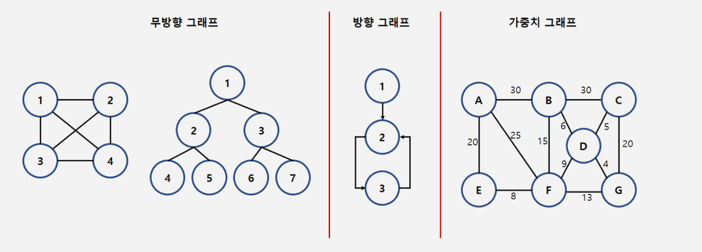

# 그래프 (Graph)

그래프는 객체 사이의 연결 관계를 표현할 수 있는 자료구조이다.

그래프는 정점(vertex)와 간선(edge)들의 유한 집합이라 할 수있다.

```
G = (V,E)
```
V(G)는 그래프 G의 정점들의 집합을, E(G)는 그래프 G의 간선들의 집합을 의미한다.


- 정점(vertex), 노드(node) : 여러 가지 특성을 가질 수 있는 객체
- 간선(edge), 링크(link) : 정점들 간의 관계
- 무방향 그래프(undirected graph) : 간선의 방향이 없는 그래프 (A,B) = (B,A)
- 방향 그래프(directed graph) : 간선의 방향이 유의미한 그래프 <A,B> != <B,A>
- 가중치 그래프(weighted graph) : 간선에 비용이나 가중치가 할당된 그래프
- 부분 그래프(subgraph) : 어떤 그래프의 정점의 일부와 간선의 일부로 이루어진 그래프
- 경로(path) : 두 정점을 잇는 간선의 열
- 루프(loop) : 한 정점에서 출발하여 자신으로 연결하는 간선
- 사이클(cycle) : 시작점과 끝점이 같은 경로
- 연결 그래프(connected graph) : 모든 정점쌍에 대하여 항상 경로가 존재하는 그래프
- 완전 그래프(complete graph) : 모든 정점이 서로 연결되어 있는 그래프
    - 무방향 그래프의 정점 수가 n이라고 하면 간선의 수는 n(n-1)/2가 된다.

## 그래프 추상 자료형
```
객체 : 정점의 집합과 간선의 집합
연산 : 
    create_graph() ::= 그래프를 생성한다.
    init(g) ::= 그래프 g를 초기화한다.
    insert_vertex(g,v) ::= 그래프 g에 정점 v를 삽입한다.
    insert_edge(g,u,v) ::= 그래프 g에 간선 (u,v)를 삽입한다.
    delete_vertex(g,v) ::= 그래프 g에 정점 v를 삭제한다.
    delete_edge(g,u,v) ::= 그래프 g에 간선 (u,v)를 삭제한다.
    is_empty(g) ::= 그래프 g가 공백상태인지 확인한다.
    adjacent(v) ::= 정점 v에 인접한 정점들의 리스트를 반환한다.
    destroy_graph(g) ::= 그래프 g를 제거한다.
```