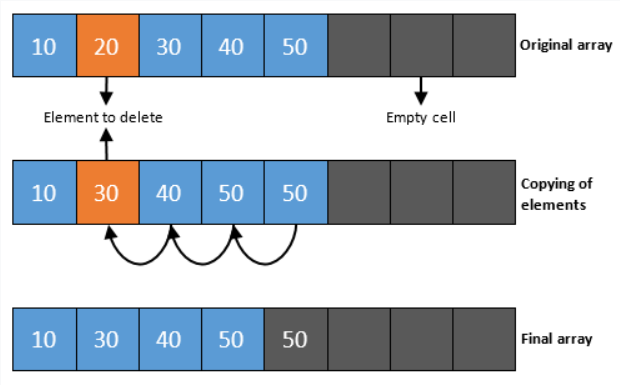

# LIST

    리스트의 자료구조는 데이터를 나란히 저장하고, 중복된 데이터의 저장을 막지 않는 자료구조이다.

    리스트 자료구조는 구현 방법에 따라서 순차 리스트와 연결 리스트로 나뉜다.

# 리스트의 추상 자료형

    - 객체 : n개의 element형으로 구성된 순서 있는 모임
    - 함수 :
        - insert(list, pos, item) ::= pos 위치에 요소를 추가한다.
        - insert_last(list, item) ::= 맨 끝에 요소를 추가한다.
        - insert_first(list, item) ::= 맨 처음에 요소를 추가한다.
        - delete(list, pos) ::= pos 위치의 요소를 제거한다.
        - clear(list) ::= 리스트의 모든 요소를 제거한다.
        - get_entry(list, pos) ::= pos 위치의 요소를 반환한다.
        - get_length(list) ::= 리스트의 길이를 구한다.
        - is_empty(list) ::= 리스트가 비어있는지를 검사한다.
        - is_full(list) ::= 리스트가 꽉 찼는지를 검사한다.
        - print_list(list) ::= 리스트의 모든 요소를 출력한다.

## 순차 리스트

    - 순차 리스트는 배열을 기반으로 구현된 리스트이다.
    - 장점 : 구현이 간단하고, 속도가 빠르다.
    - 단점 : 리스트의 크기고 고정되서 동적으로 크기를 늘리거나 줄이는 것이 힘들다. 또한 삭제나 삽입 과정에서 데이터 이동(복사)가 매우 빈번히 일어난다.

## 연결 리스트

    - 연결 리스트는 메모리의 동적 할당을 기반으로 구현된 리스트이다.
    - 연결 리스트의 종류에는 단순 연결 리스트, 원형 연결 리스트, 이중 연결 리스트가 있다.
    - 장점 : 크기가 제한되지 않고, 중간에서 쉽게 삽입하거나 삭제할 수 있는 유연한 리스트이다.
    - 단점 : 구현이 복잡하고, 임의의 항목(i번째 항목)을 추출하려고 할 때는 시간이 보다 많이 걸린다.

## 단순 연결 리스트

- 단순 연결 리스트에서는 노드들이 하나의 링크 필드를 가지며 이 링크 필드를 이용하여 모든 노드들이 연결되어 있다.
- 마지막 노드의 링크 필드 값은 NULL이 된다.

## 단순 연결 리스트 구현

[singly_linked_list.c](./singly_linked_list.c)

## 원형 연결 리스트

- 원형 연결 리스트는 단순 연결 리스트에서 마지막 노드가 첫 번쨰 노드를 가리키는 리스트이다.
- 원형 연결 리스트에서는 하나의 노드에서 다른 모든 노드로의 접근이 가능하다. 따라서 노드의 삽입과 삭제가 단순 연결 리스트보다는 용이해진다.
- 원형 연결 리스트에서 헤드 포이터가 마지막 노드를 가리키도록 구성한다면 상수 시간 안에 리스트의 처음과 끝에 노드를 삽입할 수 있다.

## 원형 연결 리스트 구현

[circular_linked_list.c](./circular_linked_list.c)

## 이중 연결 리스트

- 단순 연결 리스트와 원형 연결 리스트는 특정 노드에서 양방향으로 자유롭게 움직이기 힘들다.
- 이중 연결 리스트는 이러한 문제점을 해결하기 위해 만들어진 자료구조이다.
- 헤드 노드라는 특별한 노드를 추가하는 경우가 있는데, 이는 헤드 포인터와는 다른 것으로 데이터 필드에 아무런 정보를 담고 있지 않으며 삽입과 삭제 알고리즘을 간편하게 하기 위해 존재한다.

## 이중 연결 리스트 장단점

- 이중 연결 리스트는 하나의 노드가 선행 노드와 후속 노드에 대한 두 개의 링크를 가지는 리스트이다. 따라서 양방향으로 검색이 가능해진다.
- 이중 연결 리스트의 단점으로는 공간을 많이 차지하고 코드가 복잡해진다.
- 그럼에도 불구하고 여러 가지 장점이 많기 때문에 널리 쓰인다.

## 이중 연결 리스트 구현

[double_linked_list.c](./doubly_linked_list.c)
