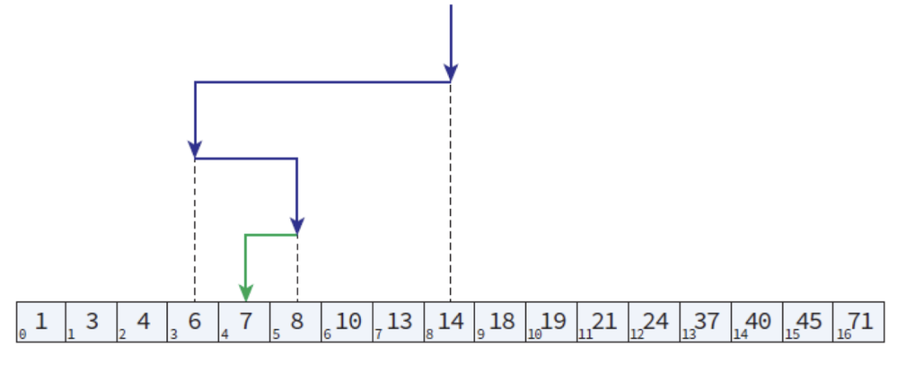

# 탐색

    탐색이란 여러 개의 자료 중에서 원하는 자료를 찾는 작업이다.

## 순차 탐색 (sequential search)

    - 순차 탐색은 탐색 방법 중에서 가장 간단하고 직접적인 탐색 방법이다.
    - 순차 탐색은 정렬되지 않은 배열의 항목들을 처음부터 마지막까지 하나씩 검사하여 원하는 항목을 찾아가는 방법이다.

```c
int seq_search(int list[], int key){
    int len = sizeof(list) / sizeof(int); 
    for(int i=0; i<len; i++)
        if(list[i] == key)
            return i;   //탐색에 성공 시 키 값의 인덱스 반환
        else -1;        //탐색에 실패 시 -1 반환
}
```

### 순차 탐색의 시간 복잡도
    - 리스트의 처음부터 탐색을 시작하여 해당 항목을 찾거나 모든 항목을 검사할 때까지 항목의 키 값을 비교한다.
    - 따라서 탐색에 성공할 경우 평균 (n+1)/2번을 비교하여 탐색이 실패한 경우 n번 비교하므로 시간 복잡도는 O(n)이 된다.

## 이진 탐색 (binary search)

    - 정렬된 배열의 탐색에는 이진 탐색이 가장 적합하다.
    - 이진 탐색은 배열의 중앙에 있는 값을 조사하여 찾고자 하는 항목이 왼쪽 또는 오른쪽 부분 배열에 있는지 알아내어 탐색의 범위를 반으로 줄이다.



```c
//순환 호출로 구현한 이진 탐색
int search_binary(int list[], int key, int low, int high){
    int middle;

    if(low <= high){
        middle = ( low+high ) / 2;
        if(key == list[middle])     //탐색 성공
            return middle;
        else if (key < list[middle])    //왼쪽 부분리스트 탐색
            return search_binary(key, low, middle-1);
        else                            //오른쪽 부분리스트 탐색
            return search_binary(key, middle + 1, high);
    }
    return -1; //탐색 실패
}
```

```c
//반복으로 구현한 이진 탐색
int search_binary(int key, int low, int high){
    int middle;

    while(low <= high){
        middle = ( low+high ) / 2;
        if(key == list[middle]) //탐색 성공
            return middle;
        else if (key > list[middle])    //오른쪽 부분리스트 탐색
            low = middle + 1;
        else                            //왼쪽 부분리스트 탐색
            high = middle - 1;
    }
    return -1;  //탐색 실패
}
```

### 이진 탐색의 시간복잡도
    - 이진 탐색은 탐색을 반복할 때마다 탐색 범위를 반으로 줄인다.
    - 탐색 범위가 더 이상 줄일 수 없는 1이 될 때의 탐색 횟수를 k라 하면 n/2^k = 1 이므로, (k = log_2 n)이므로 이진 탐색의 시간 복잡도는 O(logN)이 된다.

### [이진 탐색](#이진-탐색-binary-search)(binary search)와 [이진 탐색 트리](../binary-tree/Binary%20search%20tree/README.md#)  (binary search tree) 차이
    - 이진 탐색과 이진 탐색 트리는 근본적으로 같은 원리에 의한 탐색 구조이다.
    - 이진 탐색은 자료들이 배열에 저장되어 있으므로 삽입과 삭제가 힘들다.
    - 반면에 이진 탐색 트리는 노드로 이루어져 있어 비교적 빠른 시간 안에 삽입과 삭제를 할 수 있다.
    - 따라서 정적인 자료를 대상으로 탐색이 이루어지는 경우에는 이진 탐색을 삽입과 삭제가 빈번히 이루어진다며 반드시 이진 탐색 트리를 사용하는게 좋다.

| Algorithm |Average(탐색, 삽입)  | worst case(탐색, 삽입) |
| --- | --- | --- |
| 순차 탐색 | (N/2, N) | (N, N)
| 이진 탐색 | (logN, N/2) | (logN, N)
| 이진 탐색 트리 | (logN, logN) |  (N, N)


