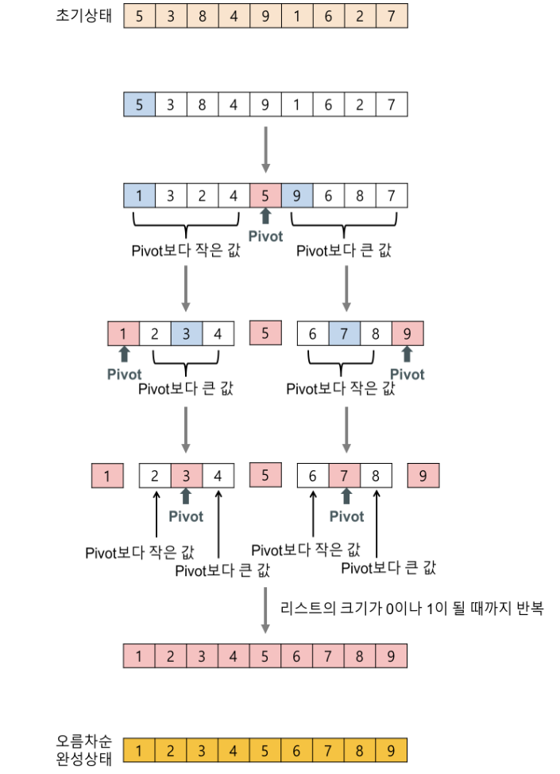

# 정렬(sorting)

    정렬은 주어진 데이터를 일전한 기준에 따라 순서대로 나열하는 것이며, 자료 탐색에 있어서 필수적이다.

    정렬의 방법
        - 오름차순(ascending) : 작은 것에서 큰 것으로, 오래된 것부터
        - 내림차순(descending) : 큰 것에서 작은 것으로, 최근 것부터
        - 단일 키(single key) : 하나의 정렬 기준으로
        - 복합 키(multi key) : 두 개 이상의 정렬 기준으로

    - 지금까지 개발된 정렬 알고리즘은 매우 많으며 이 중에서 현재의 프로그램 수행환경에서 가장 효율적인 정렬 알고리즘을 선택해야 한다.
    - 대개 정렬 알고리즘을 평가하는 효율성의 기준으로는 연산 횟수를 빅오 표기법으로 근사적으로 표현한다.

| Algorithm | Average | Worst case | Best case |
| --- | --- | --- | --- |
| 선택 정렬 | O(N^2) | O(N^2) | O(N^2)
| 삽입 정렬 | O(N^2) | O(N^2) | O(N)
| 버블 정렬 | O(N^2) | O(N^2) | O(N^2)
| 합병 정렬 | O(NlogN) | O(NlogN) | O(NlogN)

단순하지만 비 효율적인 정렬 : [선택](#선택-정렬selection-sort), [삽입](#삽입-정렬insertion-sort), [버블정렬](#버블-정렬bubble-sort) 등

복잡하지만 효율적인 정렬 : [합병](#합병-정렬merge-sort), [퀵](#퀵-정렬quick-sort), [히프 정렬](../binary-tree/Heap/README.md#히프-정렬) 등
<br/><br/>
## 선택 정렬(selection sort)

- 전체 원소들 중에서 기준 원소를 선택한 후 교환하는 방식
- 앞(가장 작은 값)에서부터 채워짐


```c
void selection_sort(int list[], int n){
    for(int i = 0; i < n-1; i++){
        for(int j = i+1; j < n; j++)
            if(list[i] > list[j]) 
                swap(list[i],list[j]);
    }
}
```

- 원소의 개수가 n일 때 , 일관되게 n(n-1)/2의 시간이 소요됨
<br/><br/>
## 삽입 정렬(insertion sort)
    - 정렬된 부분 집합에 정렬할 새 원소의 위치를 찾아 삽입
    - 전체 원소를 `정렬된 부분 집합`과 `정렬되지 않은 부분 집합`으로 분할


```c
void insertion_sort(int list[],int n){
    int key;
    for(int i=1; i<n; i++){
        key = list[i];
        for(int j=i-1; j>=0 && list[j]>key; j--)
            list[j+1] = list[j];    //레코드의 오른쪽 이동
        list[j+1] = key;
    }
}
```

- 원소의 개수가 n일 때, 평균적으로 O(N^2)의 시간복잡도를 가지고 최선의 경우에는 O(N)의 시간복잡도를 가진다.

## 버블 정렬(bubble sort)

    - 인접한 두 원소를 비교, 자리를 교환하는 방식
    - 끝(가장 큰 값)에서부터 채워짐


```c
void bubble_sort(int list[],int n){
    int tmp;
    for(int i=n-1 ; i>0; i--){
        for(int j=0; j<i; j++)
            if(list[j] > list[j+1]) 
                swap(list[j], list[j+1])    //앞뒤를 비교한 후 스왑
    }
}
```

- 원소의 개수가 n일 때, 최대 n(n-1)/2번 정렬
<br/><br/>
## 합병 정렬(merge sort)

    - 합병 정렬은 하나의 리스트를 두 개의 균등한 크기로 분할하고 분할된 부분을 정렬한 다음 두 개의 리스트를 합하는 분할 정복(divide and conquer)기법을 사용한다.
    - 합병 정렬은 3가지 단계로 이루어진다.
        1. 분할(divide) : 입력 배열을 같은 크기의 2개의 부분 배열로 분할한다.
        2. 정복(conquer) : 부분 배열을 정렬한다. 부분 배열의 크기가 충분히 작지 않으면 순환 호출을 이용하여 다시 분할 정법 기법을 적용한다.
        3. 결합(combine) : 정렬된 부분 배열들을 하나의 배열에 통합한다.


```c
//합병 정렬 알고리즘
void merge_sort(int list[], int left,  int right){
    int mid;
    if(left<right){
        mid = (left + right) / 2;       //리스트 분할
        merge_sort(list,left,mid);      //부분 리스트 정렬
        merge_sort(list,mid+1,right);       
        merge(list,left,mid,right);     //합병
    }
}
```
알고리즘 작동

1. 만약 나누어진 구간의 크기가 1 이상이면
2. 중간 위치를 계산한다.
3. 앞쪽 부분 배열을 정렬하기 위하여 merge_sort 함수를 순환 호출한다.
4. 뒤쪽 부분 배열을 정렬하기 위하여 merge_sort 함수를 순환 호출한다.
5. 정렬된 2개의 부분 배열을 통합하여 하나의 정렬된 배열로 만든다.
```c
//합병 알고리즘
void merge(int list[], int left, int mid, int right){
    int i,j,k;  //i,j는 정렬된 왼쪽,오른쪽 리스트에 대한 인덱스
                // k는 정렬될 리스트에 대한 인덱스
    i = left; j = mid+1; k=left;

    //분할된 list 합병
    while(i<=mid && j<=right){
        if(list[i]<=list[j])    //분할 리스트 요소들의 크기 비교후 분배
            sorted[k++] = list[i++];
        else
            sorted[k++] = list[j++];
    }
    if(i>mid)   //리스트에 남아있는 요소 복사
        for(int l=j; l<=right; l++)
            sorted[k++] = list[l];
    else
        for(int l=i; l<=mid; l++)
            sorted[k++] = list[l];
    // 배열 sorted[]의 리스트를 배열 list[]로 복사   
    for(int l=left; l<=right; l++)
        list[l] = sorted[l];
}
```


합병 정렬은 n개의 데이터를 가지고 log n의 단계(높이)를 거치기 때문에 시간복잡도는 O(nlogn)이 된다.
<br/><br/>
## 퀵 정렬(quick sort)

    - 퀵 정렬은 평균적으로 매우 빠른 수행 속도를 자랑하는 정렬 방법이다.
    - 퀵 정렬도 전체 리스트를 2개의 부분 리스트로 분할하고, 각각의 부분 리스트를 다시 퀵정렬하는 분할 정복(divide and conquer)을 사용한다.
    - 하지만 합병 정렬과는 달리 피봇(pivot)을 사용하여 비균등하게 리스트를 분할한다.
    - 피봇보다 작은 값은 왼쪽으로 옮겨지고 피봇보다 큰 값은 오른쪽으로 옮겨며 이를 반복하여 리스트를 정렬한다.


<br/><br/>

```c
//퀵 정렬 알고리즘
void quick_sort(int list[], int left, int right){
    if(left<right){
        int q = partition(list, left, right); //피봇기준으로 리스트 분할
        quick_sort(list, left, q-1);  // 피봇 바로 앞까지 순환호출
        quick_sort(list, q+1, right); // 피봇 바로 뒤부터 순환호출
    }
}
```
```c
int partition(int list[], int left, int right){
    int pivot,tmp;
    int low, high;

    low = left; 
    high = right+1;
    pivot = list[left]; //가장 왼쪽의 요소를 피봇으로 지정
    do{
        do                      //피봇보다 작은 요소가 나올 때까지 low++
            low++;
        while (list[low]<pivot);
        do                      //피봇보다 큰 요소가 나올 때까지 high--
            high--;
        while(list[high]>pivot);
        //list[low]와 list[high 스왑]
        if(low<high) swap(list[low],list[high]);     
    } while(low<high);  //low(left)가 high(right)보다 커질때 까지 반복
    //list[left] (pivot)와 list[high] (중앙값) 스왑
    swap(list[left],list[high]);    
    return high;    //피봇 위치 반환
    }
```

### 퀵 정렬 시간복잡도
- n개의 요소를 가지는 리스트가 있다고 하면 n/2, n/4, n/8, ... ,n/2^k의 크기로 나누어 질것이다. 따라서 (k = log_2 n)개의 깊이가 필요하게 된다. 그리고 평균 n번의 비교가 이루어지므로 시간복잡도는 O(nlog_2 n)가 된다.

<br/><br/>
- 최악의 경우에는 퀵 정렬의 깊이가 n이 되고 평균 n번의 비교 연산이 이루어지는 경우이다 이 경우에는 O(n^2)의 시간복잡도를 갖게 된다.


