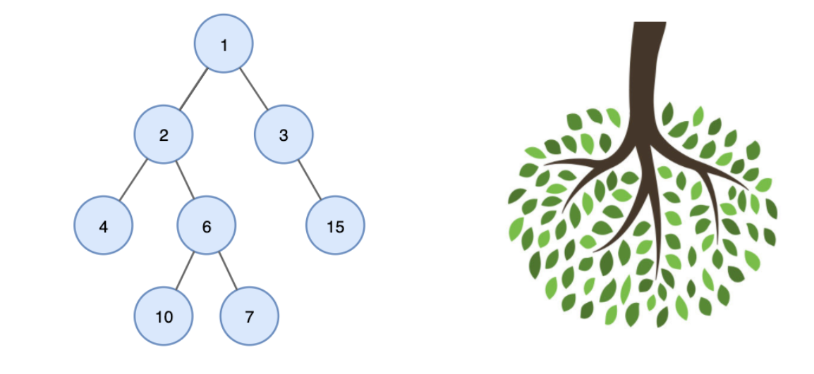

# Tree

    - 트리(Tree)란 노드들이 나무 가지 처럼 연결된 비선형 계층적 자료구조이다.
    - 트리는 한 개 이상의 노드로 이루어진 유한 집합니다.

## Tree 기본 용어

- 노드(node)
    - 트리를 구성하고 있는 기본 요소
    - 노드에는 키 또는 값과 하위 노드에 대한 포인터를 가지고 있음.

- 간선(Edge)
    - 노드와 노드 간의 연결선
    - 노드가 n개인 트리는 항상 n-1의 간선을 가진다.
- 루트 노드(Root Node)
    - 트리 구조에서 부모가 없는 최상위 노드 (A)

- 서브 트리(subtree)
    - 루트 노드를 제외한 나머지 노드의 집합

- 부모 노드(Parent Node)
    - 자식 노드를 가진 노드
    - H,I의 부모 노드는 D

- 자식 노드(Child Node)
    - 부모 노드의 하위 노드
    - D 노드의 자식 노드는 H,I

- 형제 노드(sibling Node)
    - 같은 부모를 가지는 노드
    - H,I는 같은 부모를 가지는 형제 노드

- 단말 노드(Leaf Node, Terminal Node)
    - 자식 노드가 없는 노드
    - H, I, J, F, G

- 비 단말 노드(Non-terminal Node)
    - 자식 노드를 하나 이상 가진 노드
    - A, B, C, D, E

- 레벨(level)
    - 루트에서 어떤 노드까지의 간선(Edge) 수

- 높이(height)
    - 트리가 가지고 있는 최대 레벨

- 깊이(depth)
    - 루트에서 어떤 노드까지의 간선(Edge) 수

- 차수(degree)
    - 어떤 노드가 가지고 있는 자식 노드의 개수

# 이진 트리

